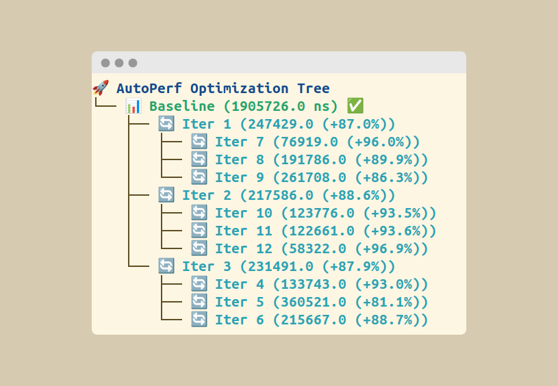

# AutoPerf

> [!NOTE]
> This project is a functional proof of concept. A more powerful and polished version is under development and will be available in the future.

AutoPerf is an AI-driven system that iteratively optimizes C++ kernels while ensuring correctness via GoogleTest and measuring performance with Google Benchmark.



## Core Principles

The project consists of two main parts:

- **`cpp/`**: A C++ project containing the kernels to be optimized, validation tests (GoogleTest), and performance benchmarks (Google Benchmark).
- **`orchestrator/`**: A Python orchestrator that uses language models (LLMs) to generate optimized versions of the C++ kernels.

## Available Kernels

- **axpy**: `y = a*x + y`
- **matvec**: Matrix-vector multiplication
- **matmul**: Matrix-matrix multiplication
- **reduce**: Array reduction (sum, min, max)
- **search**: Linear search
- **custom**: Template for a custom kernel

## Prerequisites

- CMake >= 3.20
- C++20 compiler
- Python 3.10+
- OpenMP (optional)

## Python Orchestrator

### Installation

```bash
pip install -r orchestrator/requirements.txt
```

### Configuration with Environment Variables

The project uses a centralized configuration via environment variables. Here are the most important ones:

```bash
# LLM Model
export AUTOPERF_DEFAULT_MODEL="gpt-4o"
export AUTOPERF_DEFAULT_TEMPERATURE=0.2

# Optimization Parameters
export AUTOPERF_DEFAULT_PHASES=3
export AUTOPERF_DEFAULT_BRANCHING=4

# "Thinking System" Configuration
export AUTOPERF_THINKING_MODE="budget" # (disabled, dynamic, budget)
export AUTOPERF_THINKING_BUDGET=500
```

### Execution

```bash
# Simple execution
python run_autoperf.py --kernel matmul

# Execution with specific parameters
python run_autoperf.py --kernel matmul --phases 5 --branching 4 --model "gpt-4o-mini" --jobs 16
```

## Architecture

AutoPerf has been refactored for better maintainability and extensibility. Responsibilities are now clearly separated:

- **`CppBuilder`**: Manages CMake compilation.
- **`CppTester`**: Executes GoogleTest tests.
- **`CppBenchmarker`**: Executes Google Benchmark benchmarks.
- **`KernelManager`**: Manages the kernel source code.
- **`simple_config.py`**: Centralizes configuration.

This modular architecture makes it easy to add new features and ensures system robustness.

## "Thinking" System

To improve the quality of optimizations, AutoPerf includes a "thinking" system. This allows the LLM to "think" about the best approach before generating the code.

### "Thinking" Modes

- **`disabled`** (default): The LLM generates the code directly.
- **`dynamic`**: The LLM decides on the depth of its reflection.
- **`budget`**: Reflection is limited to a defined number of tokens (`AUTOPERF_THINKING_BUDGET`).

### Usage

```bash
# Activate dynamic mode
python run_autoperf.py --kernel matmul --thinking-dynamic

# Use a budget of 500 tokens
python run_autoperf.py --kernel matmul --thinking-budget 500
```

This system allows for more relevant and targeted optimizations.
